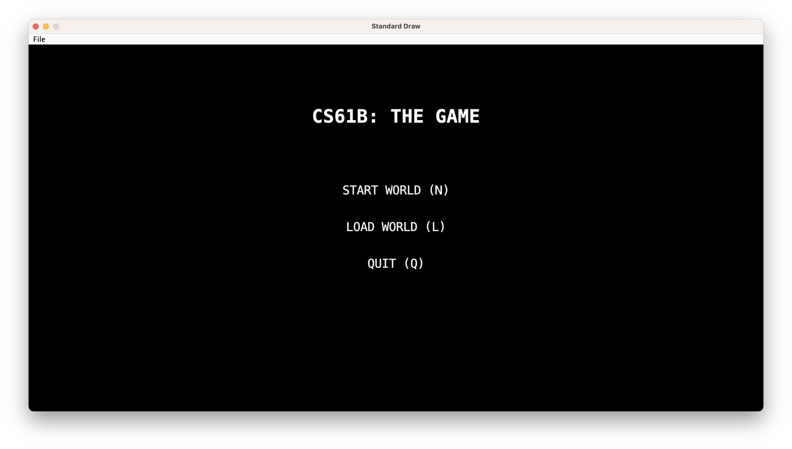
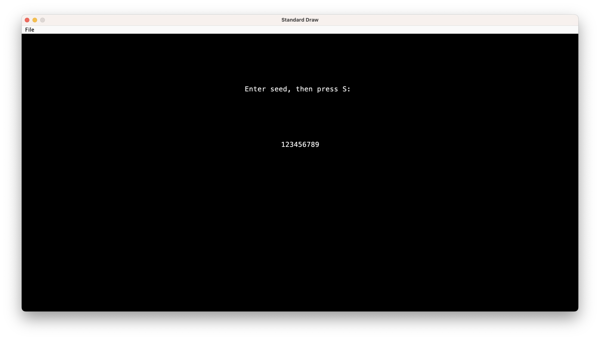
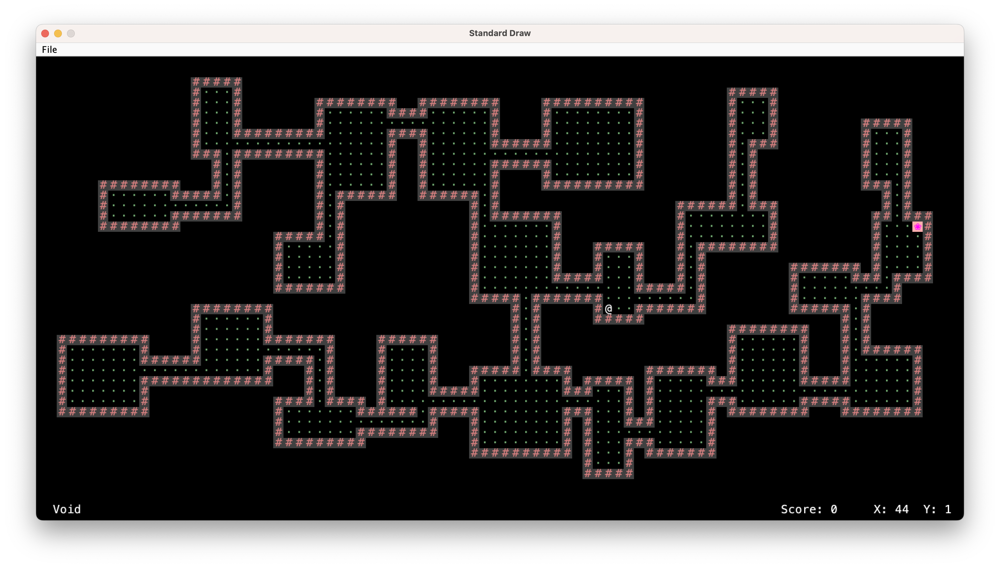
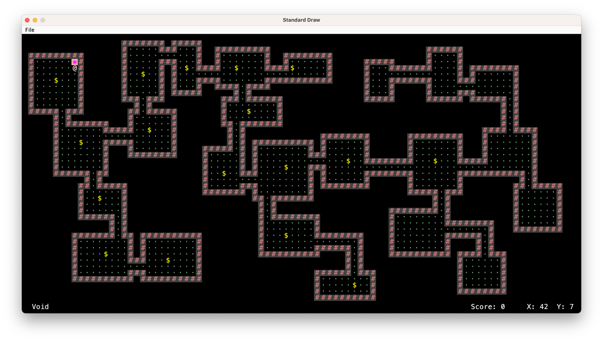
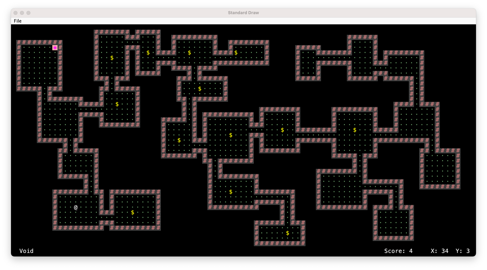

# Build Your Own World (BYOW): An Engine for Generating Explorable Worlds

## Project Overview
BYOW is an engaging 2D exploration game that offers players an immersive experience. The goal of the game is to travel through another dimension via a portal and collect as many coins as possible!

## Controls
To give players a seamless experience, the game features intuitive controls:
- **Movement**: Use the arrow keys or `WASD` to move your character.

## Game Preview
Here are some screenshots and a gameplay video to give you a glimpse of what this game has to offer:

### Loading Page

### Enter Seed and Press S to Continue

### Generate New World

### Travel Through The Portal

### Collecting Some Points

### Gameplay Video

## Technical Details
This project demonstrates a variety of technical skills and concepts:

- **Programming Language**: The game is developed in Java, ensuring robust performance and cross-platform compatibility.
- **Tile Engine**: The game features a custom tile engine that efficiently manages and renders the game world using a grid of tiles. Each tile represents a piece of the environment, such as grass, water, or obstacles.
- **World Engine**: The world engine handles the overall game logic, including player interactions, NPC behaviors, and environmental changes. It ensures a dynamic and responsive game world.
- **Game Engine**: Built with a custom game engine tailored for 2D game development. This engine integrates the tile and world engines to provide a seamless gaming experience.
- **Data Structures**: Efficient use of data structures like arrays and hash maps for optimal performance and quick access to game elements.
- **Graphics and Rendering**: Utilizes Java's AWT and Swing libraries for rendering graphics, ensuring smooth and visually appealing gameplay.